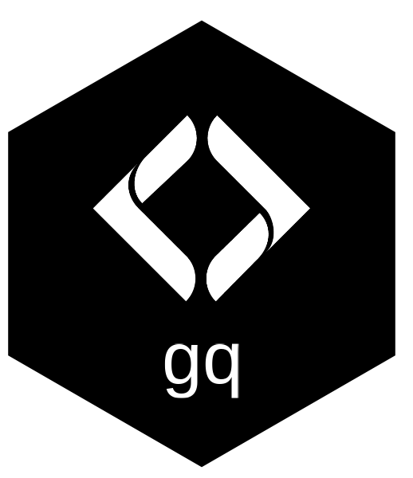

# gq 

> It's all about style.

Cartographic style management across QGIS, tmap, leaflet, MapLibre GL, and ggplot2. One canonical registry; every rendering target reads from it.

**gq** extracts symbology from QGIS projects (QML), stores it in a canonical JSON registry alongside hand-curated layers, and serves it back to whatever R / web mapping target needs it — so a colour edit in QGIS, or a width tweak in the registry, propagates to every static report, leaflet popup, and web tile without copying values around.

## Installation

```r
pak::pak("NewGraphEnvironment/gq")
```

The Python-side extractor (`python/gq/`) needs PyQGIS — install via your system's QGIS Python or a `conda` environment with `pyqgis`. The R side has no PyQGIS dependency: registries ship in `inst/registry/`, and you only re-run the extractor when QGIS projects change.

## Architecture

```
                                ┌──────────────────────────┐
                                │  Hand-curated CSVs:      │
                                │  groups / templates /    │
                                │  themes / xref_layers    │
                                └──────────┬───────────────┘
QGIS Project (.qgs / .qgz)                 │
        │ PyQGIS extract                   │ gq_reg_custom()
        ▼                                  │
   QML files (.qml)                        │
        │ parse                            │
        ▼                                  ▼
   per-project registry JSON ──── gq_reg_merge() ─── reg_main.json
        (reg_qgis_restoration,                       (master registry)
         reg_qgis_fishpassage)                              │
                                                            │ gq_style()
                                                            │ gq_*_style()
                                                            ▼
                                        ┌─────────┬──────────┬─────────────┬─────────┐
                                        │  tmap   │ leaflet  │ MapLibre GL │ ggplot2 │
                                        │  (R)    │   (R)    │   (JSON)    │  (R)    │
                                        └─────────┴──────────┴─────────────┴─────────┘
```

## Quick start

```r
library(gq)

# Read the master registry shipped with the package
reg <- gq_reg_main()

# Backend-agnostic resolver — by layer name
gq_style(reg, "lake")
gq_style(reg, "Crossings - PSCIS assessment")
#> $type
#> [1] "polygon"
#> $fill
#> $fill$color
#> [1] "#3b8bd2"
#> ...

# tmap rendering — categorical scales wired up for you
tmap::tm_shape(lakes_sf) +
  gq_tmap_style(reg, "lake")

# MapLibre GL style spec (returns JSON-ready list)
gl_style <- gq_mapgl_style(reg, "crossings_pscis_assessment")

# Compose a project from groups + themes (drives QGIS project assembly + QWC2 visibility presets)
gq_themes()            # the theme roster, per template
gq_group_layers("Crossings")
gq_template_layers("bcrestoration_mobile")

# QGIS-native style — the full QML, for anything that speaks to QGIS
gq_style_qml("lake")
gq_style_qml("land_ownership", template = "bcfishpass_mobile")
```

## Concepts

| Concept | What it is |
|---|---|
| **Registry** | The canonical JSON — per-layer styling (color, opacity, stroke, mark, font, label, classification breaks). Shipped under `inst/registry/`; one per QGIS project family (`reg_qgis_restoration`, `reg_qgis_fishpassage`) plus a merged `reg_main.json` master. |
| **Groups** | Named bundles of layers with nesting + z-order (e.g. `Crossings`, `Streams`, `Base - misc`). Drives QGIS legend tree and front-end layer pickers. 11 groups; 62 layer rows. |
| **Templates** | Project-level compositions — which groups belong to which QGIS project (`bcfishpass_mobile`, `bcrestoration_mobile`). Project-assembly tools read templates to decide which layers belong in a new field project. |
| **Themes** | Per-layer visibility presets, extracted from the templates (e.g. `High Detail - Crossings`, `Land Tenure`). Keyed by template as well as theme, because the same theme name carries different content in different templates. Drives QGIS map themes and is exportable as QWC2 web-map visibility config. |
| **xref_layers** | Cross-reference table mapping registry keys to source-system layer names (BC Data Catalogue WMS layers, fwapg views, internal pgsql schemas) so consumers can look up the underlying data when they want it. |
| **QML corpus** | The same styles in QGIS's own format, shipped under `inst/styles/`. The registry models roughly 20 symbol properties and one symbol layer, because that is what tmap and MapLibre can render; a QML carries everything QGIS authored — multi-layer symbols, casing and overlay, labelling, per-class dash. 50 shared vector styles, 3 per-template overrides, 3 rasters, 6 services. |

## Producer ⇄ consumer

| Side | What it does | Where |
|---|---|---|
| **Producer** | Extract from `.qgs` / `.qml` via PyQGIS → write per-project registry JSON. Update only when QGIS projects change. | `python/gq/`, `gq_qgs_extract()`, `data-raw/`. |
| **Consumer** | Read the registry, resolve a layer name to a backend-specific style. Pure R, no PyQGIS dependency. | `gq_style()`, `gq_tmap_style()`, `gq_mapgl_style()`, `gq_reg_main()`, `gq_reg_read()`. |

The registry JSON is the contract between the two: producers don't know about tmap or MapLibre, and a consumer rendering to those backends never touches QGIS.

Consumers rendering **to** QGIS are the exception, and `gq_style_qml()` serves them. Round-tripping a style through the registry is lossy by design; the QML corpus is the lossless path, so a Mergin field project, a QGIS Server / QWC2 deployment or a `layer_styles` table gets the symbology QGIS actually authored rather than the subset tmap needs.

## Roadmap

Active issues track the in-flight scope:

- **Symbol size/shape translator** for tmap + mapgl ([#16](https://github.com/NewGraphEnvironment/gq/issues/16))
- **Composition helpers** for tmap ([#17](https://github.com/NewGraphEnvironment/gq/issues/17)), mapgl ([#18](https://github.com/NewGraphEnvironment/gq/issues/18)), leaflet (deferred — [#19](https://github.com/NewGraphEnvironment/gq/issues/19))
- **Project-specific style overrides** convention so reports can override registry defaults without forking the registry ([#20](https://github.com/NewGraphEnvironment/gq/issues/20))
- **Multi-layer symbol extraction** — casing + overlay layers in `gq_qgs_extract()` so complex highway/road styles round-trip ([#24](https://github.com/NewGraphEnvironment/gq/issues/24))
- **QLR file support** in the extractor so layer-definition files outside `.qgs` projects can contribute styles ([#23](https://github.com/NewGraphEnvironment/gq/issues/23))
- **Shiny layer picker** module so projects can be assembled interactively from the registry ([#22](https://github.com/NewGraphEnvironment/gq/issues/22))
- **`gq_tmap_legend()`** helper — pending tmap upstream review ([#27](https://github.com/NewGraphEnvironment/gq/issues/27))

The long-term direction is [OGC API Styles](https://ogcapi.ogc.org/styles/) — once the spec is widely adopted by GIS tooling, the canonical registry becomes a server endpoint and the per-target translators become thin client wrappers.

## Vignettes

- [`gq-intro`](vignettes/gq-intro.Rmd) — registry concepts, the four registries shipped with the package, name-based lookup.
- [`gq-tmap-composition`](vignettes/gq-tmap-composition.Rmd) — composing a full tmap from the registry.

## License

MIT (see [`LICENSE`](LICENSE)).
